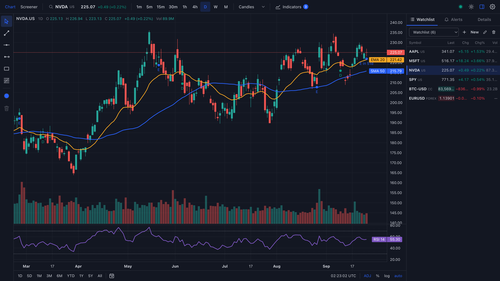
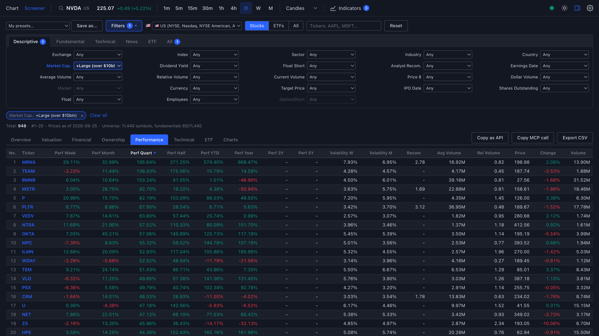
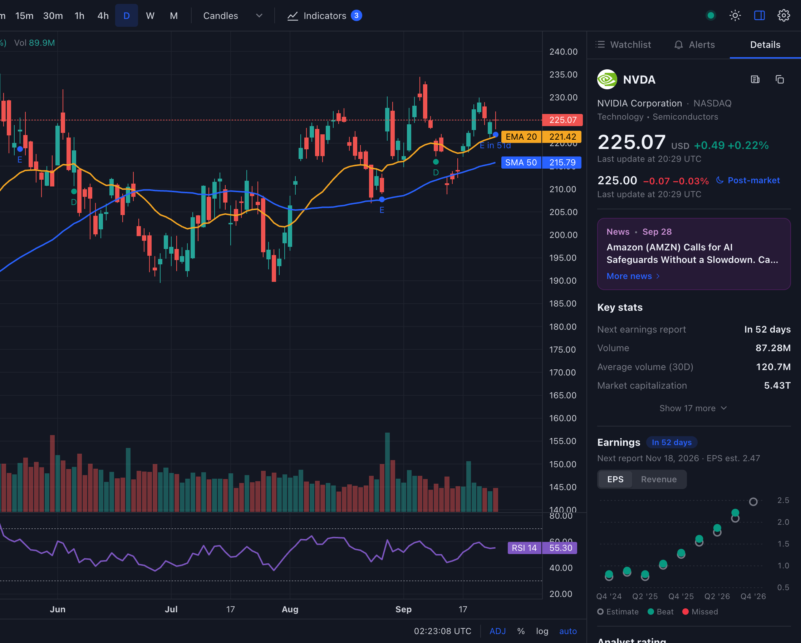

# EODView

[](https://github.com/kiamesdavies/TradingView/actions/workflows/ci.yml)
[](LICENSE)

**A self-hosted TradingView and Finviz alternative powered by your own [EODHD](https://eodhd.com) data subscription.**

Charts with live candles, indicators and drawings, a Finviz-style multi-market stock screener, a TradingView-style
symbol details panel with earnings and fundamentals, watchlists and server-side price alerts, plus a REST and MCP API
so AI agents can run screens too. One Bun server holds your API key; the browser never sees it.



<p align="center">
  
  
</p>

> Not affiliated with TradingView, Finviz or EODHD. You need your own EODHD subscription; all market data comes from
> it under its terms. Nothing here is financial advice.

## Why

If you already pay for EODHD market data, you don't need to also pay for TradingView and Finviz to chart it and
screen it. EODView turns an EODHD API key into a personal charting and screening workstation that you run on your
laptop or on a small cloud VM.

## Features

**Charting** ([lightweight-charts](https://github.com/tradingview/lightweight-charts) v5)
- Candles, bars, line, area and Heikin-Ashi; 1m → 1M timeframes with lazy history backfill.
- Live candles from EODHD's WebSocket feed (US stocks, forex, crypto); delayed quotes for other markets.
- TradingView-style range bar: 1D, 5D, 1M, 3M, 6M, YTD, 1Y, 5Y, All, go-to-date, time zone clock, ADJ (split/dividend
  adjusted), %, log and auto scale.
- Earnings, dividend and split markers (E/D/S) with EPS-vs-estimate tooltips.
- Indicators: SMA, EMA, VWAP, Bollinger Bands, RSI, MACD, ATR, Volume MA (oscillators in their own panes).
- Drawings: trendline, horizontal line and ray, rectangle, Fibonacci retracement; saved per symbol.

**Symbol details panel**
- Logo, price with pre-market/post-market line, latest news, key stats, EPS/revenue chart with beats and misses,
  analyst consensus and price target, company profile.

**Screener** (Finviz-style)
- ~90 filters using Finviz's vocabulary across Descriptive, Fundamental, Technical, News and ETF tabs, plus custom
  min/max ranges. Finviz URL codes work too (`cap_midover,ta_sma50_pa,ta_perf_13wup`).
- Views: Overview, Valuation, Financial, Ownership, Performance, Technical, ETF and a mini-chart grid. Sorting, paging,
  saved presets, CSV export.
- Multi-market: US, Australia, Taiwan, Oslo, Xetra and Stockholm by default (chosen by a
  [momentum study](docs/MARKET-STUDY.md)); 19 markets supported. Size and liquidity filters compare in USD, and filters
  are greyed out where a market lacks the data.
- Runs on a local database built by a background pipeline from EODHD bulk end-of-day data and per-ticker
  fundamentals, within a daily API-credit budget you control.

**Watchlists and alerts**
- Multiple watchlists with live quotes; server-side price alerts with toasts and browser notifications.

**Agent API**
- REST (`/api/v1/screen?f=<finviz codes>`), OpenAPI spec and an [MCP](https://modelcontextprotocol.io) server at `/mcp`
  with tools such as `screen`, `list_filters`, `symbol_overview` and `get_bars`. Read-only tokens, rate limits and a
  separate credit budget. See [docs/AGENT-API.md](docs/AGENT-API.md).

## Quick start

Requirements: [Bun](https://bun.sh) ≥ 1.1.36, Node ≥ 20.19 (Vite 8 builds the client), and an EODHD API key
(the screener's fundamentals need a plan that includes fundamentals data).

```bash
git clone https://github.com/kiamesdavies/TradingView.git eodview
cd eodview
bun install
bun run dev            # server on :3001, Vite dev server on :5173
```

Open http://localhost:5173. The Settings dialog opens and asks for your EODHD API key; it is validated and stored
server-side in `server/data/config.json` (or set `EODHD_API_KEY`).

Production, as a single process that serves the built client, API, WebSocket and MCP:

```bash
bun run build
PORT=3001 bun run start
```

Or with Docker:

```bash
docker build -t eodview .
docker run -p 3001:3001 -v eodview-data:/data -e EODHD_API_KEY=... eodview
```

## Hosting it

[`deploy/`](deploy/README.md) contains a complete, low-cost setup for Google Cloud and Cloudflare:
- Terraform for a small VM with no public IP, SSH only through IAP, and daily disk snapshots;
- a Cloudflare Tunnel, so the server has no open inbound ports, with Cloudflare Access login in front;
- Secret Manager for the keys, and a one-command `deploy.sh` (Cloud Build, then a rollout over IAP).

Expect about $25–30 a month.

EODView has no user accounts of its own. Don't expose it to the internet without an authenticating proxy such as
Cloudflare Access; see [SECURITY.md](SECURITY.md).

## Documentation

| Doc | What's in it |
|---|---|
| [docs/CONFIGURATION.md](docs/CONFIGURATION.md) | API key, security model, screener pipeline and credit budget, endpoints, environment variables, scripts, code layout |
| [docs/AGENT-API.md](docs/AGENT-API.md) | REST v1, Finviz filter codes, MCP setup for Claude Code and other clients, tokens |
| [deploy/README.md](deploy/README.md) | Hosting on GCP behind Cloudflare Tunnel + Access |
| [docs/MARKET-STUDY.md](docs/MARKET-STUDY.md) | Which markets reward momentum swing trading (2014–2026, ~20 exchanges) |
| [docs/ARCHITECTURE.md](docs/ARCHITECTURE.md) | Module contract between server and client |
| [docs/REQUIREMENTS.md](docs/REQUIREMENTS.md) | Functional requirements by version |
| [docs/LIMITATIONS.md](docs/LIMITATIONS.md) | Known limitations |

## Tech stack

Bun (HTTP, WebSocket, `bun:sqlite`) · TypeScript · React 19 · Zustand · Vite 8 ·
lightweight-charts 5 · EODHD REST + WebSocket APIs · Terraform · Docker · Cloudflare Tunnel/Access.

```
browser (React + lightweight-charts) ──REST /api, WS /ws──▶ Bun server ──HTTPS/WSS──▶ EODHD
AI agents ─────────────────────────────REST /api/v1, /mcp──▶     │
                                                                  └─ SQLite: bar cache, screener universe, watchlists, alerts
```

## Development

```bash
bun test               # ~580 unit tests (indicators, pipeline, screener SQL, agent API, UI helpers…)
bun run typecheck      # tsc for server and client
```

Contributions are welcome — see [CONTRIBUTING.md](CONTRIBUTING.md).

## License

[MIT](LICENSE)
